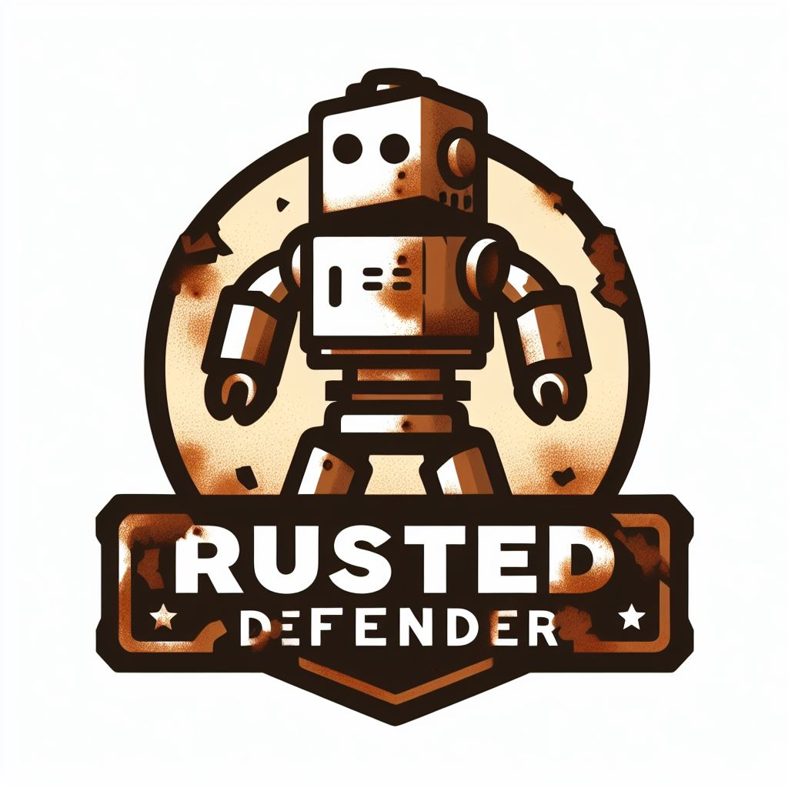

# Rusted Defender

 
     

 
    
Contents

     <ol> 
        <li> 
            <a href="#introduction">Introduction</a> 
        </li> 
        <li> 
            <a href="#status">Status</a> 
        </li> 
        <li> 
            <a href="#roadmap">Roadmap</a> 
        </li> 
        <li> 
            <a href="#stay-tuned">Stay Tuned!</a> 
        </li> 
        <li> 
            <a href="#development-and-running-locally">Development and Running locally</a> 
            </li> 
    </ol> 

## Introduction

Welcome to Rusted Defender, a thrilling and action-packed game promising excitement and adventure! Prepare to embark on an unforgettable journey through a world of rust and adventure. Rusted Defender offers an exciting gaming experience, designed especially for primary school learners. Enter a world teeming with challenges, adversaries, and incredible adventures while enjoying a fantastic time.
Status

Please note that this project is currently under construction. Please check back for updates!

## Roadmap

### Done Stuff:

    [x] Player sprite control implemented.
    [x] Collision mechanics incorporated.
    [x] Projectile and firing functionality realized.

### Not Done:

    [ ] Refactor code using the new sprite attributes struct.
    [ ] Develop a splash screen.
    [ ] Create a start menu screen.
    [ ] Implement a scoring/lives system.
    [ ] Establish a comprehensive roadmap for the game overall.
    [ ] More to come?

## Stay Tuned!

Excitement abounds as we prepare to share Rusted Defender with you, and updates will be provided on our progress. Be sure to check back for the latest news and announcements as we work to create a memorable experience for players of all ages. Your interest in Rusted Defender is greatly appreciated!
Development and Running locally:

This project uses cargo and can be run once cargo and rust are properly installed via this command:

cargo run --features bevy/dynamic_linking

[<a href="#readme-top">RETURN TO TOP</a>]

